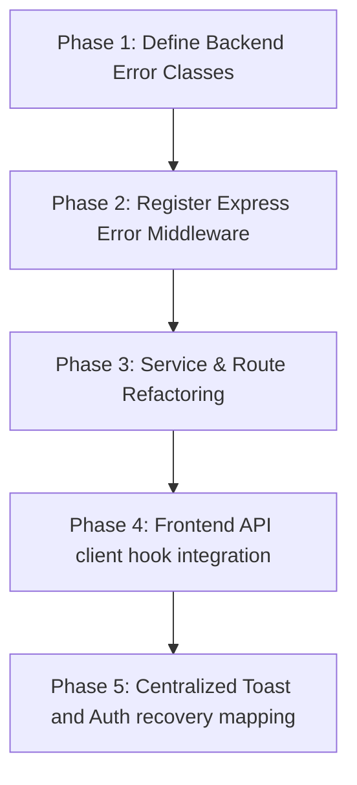

# Centralized Error Handling Discovery Audit

This document presents the architectural audit of error handling patterns across the CarUp Monorepo (`web/src` and `backend`), identifying security risks, duplication, and providing a standardized design pattern and roadmap for a centralized error-handling system.

---

## 1. Frontend Error Handling Patterns

Our search identified **103 catch blocks** and **45 `toast.error` invocations** in `web/src`. The core patterns include:

### A. Manual Try-Catch & Toast Duplication
Almost every page component (such as `Login.tsx`, `Register.tsx`, `SellVehicle.tsx`, `Claims.tsx`, etc.) wraps API actions inside local `try-catch` blocks and fires manual error notifications:
```typescript
// Found in web/src/pages/auth/Login.tsx
} catch (e) {
  toast.error('Network error. Backend is offline.')
}
```
This causes wide duplication and lacks consistent fallback defaults when the backend returns blank or unexpected errors.

### B. Raw Backend Error Extraction
Frontend components extract the raw error string from API response JSON payloads and pass them directly to `toast.error`:
```typescript
// Found in web/src/pages/auth/Register.tsx
const errorData = await res.json()
toast.error(errorData.error || 'Registration failed')
```
If the backend returns a database constraint failure or internal server trace, the user is directly exposed to database schema names and technical diagnostics.

### C. Missing Auth & API State Recovery Fallback
Inside `useCarUpApi.ts`, the generic `request` helper intercepts non-2xx responses and throws a generic `Error`:
```typescript
if (!response.ok) {
  const errorData = await response.json().catch(() => ({}))
  throw new Error(errorData.error || `HTTP error! status: ${response.status}`)
}
```
* **Critical Gap**: If the API returns `401 Unauthorized` (e.g. session expired or invalid token), the hook simply rethrows the error. It does not automatically trigger the global `logout()` function from `AuthContext` or redirect the user back to the login page `/login`. Every calling page must manually check and handle session invalidation.

### D. Silent Failures
Inside `AuthContext.tsx`, the `switchRole` callback executes an asynchronous network call but handles failures silently:
```typescript
// Found in web/src/context/AuthContext.tsx
if (res.ok) {
  // ...
}
} catch (e) {
  console.error('Role switch failed', e)
}
```
If the network is down or the request fails, it simply prints `console.error` to the developer console. The user gets no visual feedback (no toast, no modal), and the UI remains stuck.

---

## 2. Backend Error Handling Patterns

Our search identified **74 catch blocks** and **81 `res.status(500)` calls** in `backend`. The core patterns include:

### A. Complete Absence of Centralized Error Middleware
There is no centralized Express error-handling middleware (`app.use((err, req, res, next) => {})`) registered in `backend/server.js` or standard router files. 

### B. High Boilerplate try-catch Redundancy
Every single API route endpoint in `backend/server.js` and individual service routes repeats the same identical generic block:
```javascript
// Repeated 62 times in backend/server.js
} catch (error) {
  console.error('Error description:', error);
  res.status(500).json({ error: error.message });
}
```
This bloats the codebase, makes it difficult to maintain global logging structures, and leads directly to security risks.

### C. Standard Error Throwing without Domains
Our services (e.g. `escrowService.js`, `storageService.js`, `trustService.js`) throw standard generic JavaScript `Error` objects instead of structured custom error types:
```javascript
// Found in backend/services/safepay/escrowService.js
if (!escrow) throw new Error('Escrow not found');
```
Because the thrown errors do not carry custom HTTP status mappings, the calling router defaults every error to a generic `500 Internal Server Error`, even if the actual failure is a user input validation error (400) or missing resource (404).

---

## 3. Duplicated Handlers Matrix

| Component | Error Trigger | Handler / Action | Duplication Severity |
| :--- | :--- | :--- | :--- |
| **Backend Routers** | DB / Service Error | `res.status(500).json({ error: error.message })` | **Extreme** (81 manual occurrences) |
| **Frontend Views** | API Network Fail | `toast.error('Network error...')` | **High** (45 manual occurrences) |
| **Auth Views** | Invalid Inputs | `toast.error(errorData.error \|\| 'Default')` | **Medium** (Manual check in Login/Register) |
| **AuthContext** | Switch Role fail | `console.error('Role switch failed', e)` | **Low** (Silent failure, missing UI trigger) |

---

## 4. Security Risks & System Vulnerabilities

Exposing the raw `error.message` of catch statements presents major security risks:

1. **Information Disclosure (Supabase PostgreSQL Schemas)**:
   Supabase error objects directly leak internal PostgreSQL field types, database constraints, table associations, or column names (e.g., `"null value in column 'vin' violates not-null constraint"`). A malicious user could exploit this database layout schema information to perform target injection attacks.
2. **Path & Environment Leaks**:
   Errors thrown during file system or local operations leak absolute operating system paths and dependencies directly in HTTP JSON payloads.
3. **No Request IDs**:
   Because error events do not write unique tracking keys (e.g., `req-xxxx`) to payloads and central logs, auditing user-reported errors in production is highly complex.

---

## 5. Recommended Centralized Error Format

To resolve these issues, we recommend standardizing on a structured, centralized JSON payload format for all API errors:

### Standard API JSON Error Payload
```json
{
  "success": false,
  "error": {
    "code": "ERROR_CODE",
    "message": "User-friendly, localized description of the problem.",
    "details": "Optional developer-facing diagnostics (omitted in production viewports)",
    "timestamp": "2026-06-01T22:15:00.000Z",
    "requestId": "req-98f237f8-bc4a"
  }
}
```

### Central Error Registry Code Maps
- `UNAUTHORIZED_ACCESS`: Session token has expired or is invalid (HTTP 401).
- `INSUFFICIENT_PERMISSIONS`: Authenticated user lacks stakeholder role privileges (HTTP 403).
- `RESOURCE_NOT_FOUND`: VIN, work order, claim, or user record does not exist (HTTP 404).
- `VALIDATION_FAILED`: Query parameters or POST payloads fail format criteria (HTTP 400).
- `INTERNAL_SERVER_ERROR`: Generic unhandled backend runtime failures (HTTP 500).
- `DATABASE_ERROR`: Supabase transactional or query failures (HTTP 500).

---

## 6. Phased Implementation Roadmap

To transition the codebase securely without breaking existing functionality, we propose the following phased implementation sequence:



### Phase 1: Define Backend Error Classes
- Create `backend/utils/errors.js` containing a unified `CarUpError` base class extending `Error`.
- Define specific sub-classes carrying explicit HTTP status codes:
  - `ValidationError` (400)
  - `UnauthorizedError` (401)
  - `ForbiddenError` (403)
  - `NotFoundError` (404)
  - `DatabaseError` (500)

### Phase 2: Register Express Error Middleware
- Create `backend/middleware/errorMiddleware.js`:
  - Intercepts thrown errors inside the Express lifecycle.
  - Automatically writes tracking request IDs (`uuid`) and logs the full stack trace to the console.
  - Formats the response payload matching our standard JSON schema.
  - Omits internal trace diagnostic data (`error.details` or stack trace) if `process.env.NODE_ENV === 'production'`.
- Register the middleware at the bottom of `backend/server.js`: `app.use(errorHandler)`.

### Phase 3: Service & Route Refactoring
- Refactor individual backend services to throw these custom classes (e.g. `throw new NotFoundError('Vehicle not found')`).
- Remove manual `try-catch` route wrappers from `server.js` by using the `express-async-handler` utility wrapper or passing errors via `next(error)`.

### Phase 4: Frontend API Client hook Integration
- Update `web/src/hooks/useCarUpApi.ts`:
  - Parse the standardized error JSON shape.
  - **Auth Session Recovery**: If the error payload code is `UNAUTHORIZED_ACCESS` (or status is 401), immediately invoke `logout()` from `AuthContext` to clear expired tokens and redirect the user back to the login route `/login` safely.
  - Propagate strongly-typed API Error objects upstream.

### Phase 5: Centralized UI Toast Mapping
- Implement a unified error interceptor mapping standard error codes to localized user-friendly notification alerts.
- Remove redundant manual `try-catch` blocks inside view modules to rely on the centralized client hook state notifications.
