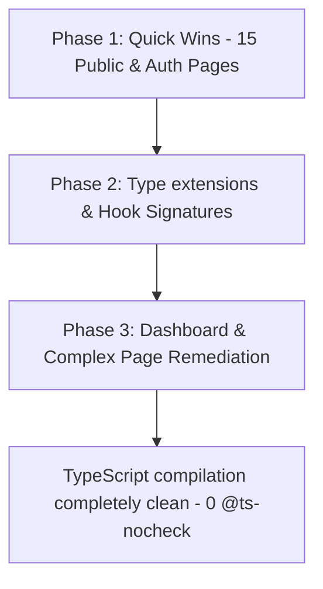

# Insurance + Public Pages Type Discovery Audit Report

This audit documents the remaining type debt and compiler warnings in the Insurance dashboards, public pages, and authentication routes. A concurrent compilation check was performed by temporarily removing `@ts-nocheck` directives to capture exact compiler diagnostics.

---

## 📊 Summary of Remaining Type Debt

Across the target folders (`dashboard/insurance`, `pages/`, and `pages/auth`), the exact counts are:

- **`@ts-nocheck` count**: **19** (All remaining project-wide `@ts-nocheck` directives are in these files!)
- **`any[]` count**: **1**
- **`:any` count**: **10**

### Target Files Audited (19 Files)

1. `web/src/pages/dashboard/insurance/RiskAnalysis.tsx`
2. `web/src/pages/dashboard/insurance/InsuranceDashboard.tsx`
3. `web/src/pages/GarageDirectory.tsx`
4. `web/src/pages/Pricing.tsx`
5. `web/src/pages/HelpCenter.tsx`
6. `web/src/pages/PrivacyPolicy.tsx`
7. `web/src/pages/DealerDirectory.tsx`
8. `web/src/pages/auth/OTPVerification.tsx`
9. `web/src/pages/auth/Login.tsx`
10. `web/src/pages/auth/Register.tsx`
11. `web/src/pages/auth/KYCVerification.tsx`
12. `web/src/pages/VehicleSearch.tsx`
13. `web/src/pages/Contact.tsx`
14. `web/src/pages/InsuranceDirectory.tsx`
15. `web/src/pages/TermsOfService.tsx`
16. `web/src/pages/Blog.tsx`
17. `web/src/pages/Marketplace.tsx`
18. `web/src/pages/Landing.tsx`
19. `web/src/pages/VehicleDetail.tsx`

---

## 🔍 Compiler Errors by File

### 🟢 Category A: Clean Wins (Zero Compile Errors or Unused Imports Only)
The following **15 files** compile successfully immediately upon removing `@ts-nocheck` (or have only unused imports/variables that can be automatically pruned):

* **`web/src/pages/auth/OTPVerification.tsx`**
  - **Status**: 0 errors. Fully clean!
* **`web/src/pages/TermsOfService.tsx`**
  - **Status**: 0 errors. Fully clean!
* **`web/src/pages/Marketplace.tsx`**
  - **Status**: 0 errors. Fully clean! *(Note: has 1 `any[]` and 3 `:any` which should be refactored to use `Vehicle[]` and `Vehicle` types).*
* **`web/src/pages/Pricing.tsx`**
  - **Unused**: `Zap` from lucide.
* **`web/src/pages/HelpCenter.tsx`**
  - **Unused**: `ChevronUp` from lucide.
* **`web/src/pages/DealerDirectory.tsx`**
  - **Unused**: `Car` from lucide.
* **`web/src/pages/auth/Login.tsx`**
  - **Unused**: Local utility function `getRoleFromEmail`.
* **`web/src/pages/auth/Register.tsx`**
  - **Unused**: `Badge` from components/ui.
* **`web/src/pages/VehicleSearch.tsx`**
  - **Unused**: `Button` from components/ui.
* **`web/src/pages/Contact.tsx`**
  - **Unused**: `Car` from lucide.
* **`web/src/pages/InsuranceDirectory.tsx`**
  - **Unused**: `FileText` from lucide.
* **`web/src/pages/GarageDirectory.tsx`**
  - **Unused**: `Link` from react-router-dom; `Mail`, `Wrench`, `Users` from lucide.
* **`web/src/pages/PrivacyPolicy.tsx`**
  - **Unused**: `useRef` from react; `Link` from react-router-dom; `Eye`, `FileText`, `ArrowUpRight` from lucide.
* **`web/src/pages/Blog.tsx`**
  - **Unused**: `User` from lucide; `ThumbsUp` from lucide; `gridArticles` local variable.
* **`web/src/pages/Landing.tsx`**
  - **Unused**: `Search`, `TrendingUp` from lucide.

---

### 🟡 Category B: Files with Type/State Mismatches (4 Files)

#### 1. `web/src/pages/dashboard/insurance/RiskAnalysis.tsx`
- **Errors**:
  - `error TS6133`: `TrendingUp`, `Car`, `AlertTriangle`, `Sparkles`, `DollarSign` are declared but never read.
  - `error TS2345`: Argument of type 'string' is not assignable to parameter of type 'SetStateAction<number>'. (lines 78, 82)
- **Remediation**:
  - Prune the 5 unused lucide imports.
  - Coerce raw string `e.target.value` to `Number(e.target.value)` inside standard numeric input handlers.

#### 2. `web/src/pages/dashboard/insurance/InsuranceDashboard.tsx`
- **Errors**:
  - `error TS6133`: `TrendingUp`, `Clock` (lucide) and `BarChart`, `Bar` (recharts) are declared but never read.
- **Remediation**:
  - Prune the unused chart and icon imports.

#### 3. `web/src/pages/auth/KYCVerification.tsx`
- **Errors**:
  - `error TS6133`: `storagePath` state variable is declared but never read.
  - `error TS2339`: Property 'request' does not exist on type `useCarUpApi` hook return value. (line 29)
- **Remediation**:
  - Remove the unused `storagePath` state hook.
  - Fix API boundary: Expose `uploadKycDocument(docType, base64Data, nationalId)` in `useCarUpApi.ts` instead of attempting to call low-level `request` inside page level handlers.

#### 4. `web/src/pages/VehicleDetail.tsx`
- **Errors**:
  - `error TS6133`: `vehicles` mock data import is declared but never read.
  - `error TS2339`: Property 'tenant' does not exist on type 'Vehicle'. (lines 66, 67, 68, 69)
  - `error TS2554`: Expected 3 arguments, but got 4 on `submitFinancing(...)`. (line 140)
  - `error TS7006`: Parameters `img`, `i`, and `f` implicitly have an 'any' type. (lines 244, 288)
- **Remediation**:
  - Prune the unused mock data import.
  - Extend `Vehicle` interface in `web/src/types/index.ts` to include optional fields: `tenant` (`name`, `phone`, `logo_url`), `features`, `sellerName`, `sellerPhone`, `sellerAvatar`, `sellerType`, `location`, `province`, `listingDate`, and `engineNumber`.
  - Fix hook mismatch: Update `submitFinancing` in `useCarUpApi.ts` to accept the 4th parameter `customerId` to match the invocation signature.
  - Refactor `useState<any>(null)` to `useState<Vehicle | null>(null)` so that list elements are inferred correctly without triggering implicit `any` parameter checks.

---

## 🔀 API Boundary & Hook Mismatches

1. **KYC Document Upload Endpoint**:
   - `KYCVerification.tsx` attempts to destructure and execute `request` from the core API hook.
   - *Fix*: Expose `uploadKycDocument(docType: string, base64Data: string, nationalId: string)` in `useCarUpApi.ts`.
2. **Financing Submission Signature**:
   - `VehicleDetail.tsx` passes 4 arguments: `submitFinancing(vehicle.vin, 'u1', selectedBank, parseFloat(loanAmount))`.
   - The hook `useCarUpApi` only accepts 3: `submitFinancing(vin, bankId, requestedAmount)`.
   - *Fix*: Update `submitFinancing` signature to accept `customerId` as the second parameter.

---

## 📅 Recommended Remediation Order

We recommend a **3-Phase Remediation Sprint** to bring the remaining codebase to 100% type stabilization:

1. **Phase 1: Clean Wins (15 files)**:
   - Target files like `Marketplace.tsx`, `OTPVerification.tsx`, `TermsOfService.tsx`, and files with simple unused imports.
   - Remove `@ts-nocheck`, clean the unused code, and refactor any explicit `any` usage.
2. **Phase 2: Types & API Boundaries**:
   - Add fields to `Vehicle` interface in `web/src/types/index.ts`.
   - Expose `uploadKycDocument` and update `submitFinancing` in `useCarUpApi.ts`.
3. **Phase 3: Complex Remediation (4 files)**:
   - Resolve mismatches in `RiskAnalysis.tsx`, `InsuranceDashboard.tsx`, `KYCVerification.tsx`, and `VehicleDetail.tsx`.
