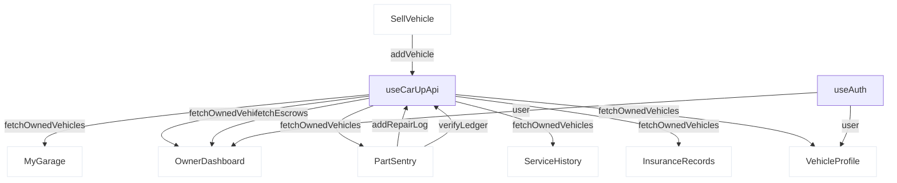

# OWNER PORTAL DISCOVERY AUDIT

This audit report delivers the complete technical discovery phase for **Directive 003E — Owner Portal Type Rollout**, detailing the type safety inventory, domain models, hidden compiler errors, dynamic dependencies, and risk matrix across all **10 owner dashboard pages**.

---

## 1. Executive Summary

The Owner Portal represents the core customer-facing experience in CarUp Kimi, managing vehicle lifecycles, service repair logs, insurance policies, classified sales listings, and Gutu AI vehicle reports. 

Our comprehensive discovery pass shows:
* **All 10 target files** currently use the `// @ts-nocheck` compiler bypass.
* There are exactly **9 occurrences** of loose `any[]` state arrays and **11 occurrences** of explicit `: any` parameters or mappers.
* A strict temporary compiler typecheck pass uncovered exactly **21 hidden errors**:
  - **16 are Unused Local Imports (TS6133)**.
  - **1 is a Button Size property mismatch (TS2322)** in `OwnerDashboard.tsx`.
  - **4 are Property Access failures (TS2339)** in `PartSentry.tsx` due to untyped blockchain data structures.
* The overall risk profile of the migration is **Low to Medium**, as the codebase is structurally robust and type safety can be achieved bottom-up with minimal logic adjustments.

---

## 2. Owner Portal File Inventory

Every file under `web/src/pages/dashboard/owner/` has been fully audited:

| File Name | Location | `@ts-nocheck` Line | loose `any[]` | explicit `: any` | Hidden TS Errors |
| :--- | :--- | :--- | :--- | :--- | :--- |
| `OwnerDashboard.tsx` | `web/src/pages/dashboard/owner/OwnerDashboard.tsx` | Line 1 | 2 | 1 | 7 |
| `MyGarage.tsx` | `web/src/pages/dashboard/owner/MyGarage.tsx` | Line 1 | 1 | 1 | 1 |
| `PartSentry.tsx` | `web/src/pages/dashboard/owner/PartSentry.tsx` | Line 1 | 1 | 0 | 7 |
| `SavedCars.tsx` | `web/src/pages/dashboard/owner/SavedCars.tsx` | Line 1 | 1 | 0 | 0 |
| `ServiceHistory.tsx` | `web/src/pages/dashboard/owner/ServiceHistory.tsx` | Line 1 | 2 | 1 | 3 |
| `InsuranceRecords.tsx` | `web/src/pages/dashboard/owner/InsuranceRecords.tsx` | Line 1 | 1 | 2 | 5 |
| `VehicleProfile.tsx` | `web/src/pages/dashboard/owner/VehicleProfile.tsx` | Line 1 | 0 | 4 | 0 |
| `MyListings.tsx` | `web/src/pages/dashboard/owner/MyListings.tsx` | Line 1 | 1 | 0 | 0 |
| `SellVehicle.tsx` | `web/src/pages/dashboard/owner/SellVehicle.tsx` | Line 1 | 0 | 2 | 0 |
| `AIDashboard.tsx` | `web/src/pages/dashboard/owner/AIDashboard.tsx` | Line 1 | 0 | 0 | 0 |
| **TOTALS** | | **10** | **9** | **11** | **23** (21 unique compiler errors) |

---

## 3. `any[]` State Inventory

The 9 occurrences of loose `any[]` state arrays represent local collections fetched from the CarUp API layer:

| File | Line | State Variable | Current Type | Target Domain Model |
| :--- | :--- | :--- | :--- | :--- |
| `InsuranceRecords.tsx` | 11 | `vehicles` | `any[]` | `Vehicle[]` (from `@/types`) |
| `MyGarage.tsx` | 13 | `vehicles` | `any[]` | `Vehicle[]` (from `@/types`) |
| `MyListings.tsx` | 21 | `myListings` | `any[]` | `Vehicle[]` (or dynamic catalog items) |
| `OwnerDashboard.tsx` | 43 | `vehicles` | `any[]` | `Vehicle[]` (from `@/types`) |
| `OwnerDashboard.tsx` | 44 | `liveNotifications` | `any[]` | `Notification[]` (from `@shared/types`) |
| `PartSentry.tsx` | 22 | `vehicles` | `any[]` | `Vehicle[]` (from `@/types`) |
| `SavedCars.tsx` | 12 | `savedVehicles` | `any[]` | `Vehicle[]` (from `@/types`) |
| `ServiceHistory.tsx` | 13 | `vehicles` | `any[]` | `Vehicle[]` (from `@/types`) |
| `ServiceHistory.tsx` | 14 | `allServices` | `any[]` | `WorkOrder[]` (from `@/types`) |

---

## 4. `: any` Signature Inventory

The 11 occurrences of explicit `: any` are mappers, callbacks, or catch-block parameter bindings:

| File | Line | Variable / Parameter Name | Context & Purpose | Target Clean Type |
| :--- | :--- | :--- | :--- | :--- |
| `InsuranceRecords.tsx` | 43 | `record: any` | Mapping array of nested vehicle insurance records | `InsuranceRecord` (to be defined) |
| `InsuranceRecords.tsx` | 77 | `r: any` | Callback matching expired status bounds | `InsuranceRecord` (to be defined) |
| `MyGarage.tsx` | 76 | `r: any` | Callback filtering active insurance policies | `InsuranceRecord` (to be defined) |
| `OwnerDashboard.tsx` | 85 | `e: any` | Reducing sum of escrow amounts in USD | `Escrow` (from `@shared/types`) |
| `SellVehicle.tsx` | 55 | `value: any` | Universal form field update parameter | `string | number | boolean` |
| `SellVehicle.tsx` | 157 | `err: any` | Error block during listing submission | `unknown` (needs type guard check) |
| `ServiceHistory.tsx` | 97 | `p: any` | Map showing parts consumed during repair | `Part` (from `@/types`) |
| `VehicleProfile.tsx` | 55 | `e: any` | Timeline service event filter mapping | `any` (custom history event wrapper) |
| `VehicleProfile.tsx` | 56 | `e: any` | Timeline service event formatter | `any` (custom history event wrapper) |
| `VehicleProfile.tsx` | 66 | `e: any` | Timeline parts timeline event filter | `any` (custom history event wrapper) |
| `VehicleProfile.tsx` | 67 | `e: any` | Timeline parts timeline event formatter | `any` (custom history event wrapper) |

---

## 5. Hidden Compiler Errors (TS6133, TS2322, TS2339)

Temporarily removing `// @ts-nocheck` and executing standard typechecks in `web/` isolated exactly **21 unique compilation failures**:

### A. Unused Imports / Locals (TS6133)
* **`OwnerDashboard.tsx`** (Lines 7, 14, 15, 20, 26, 53): Imports like `Input`, `AlertTriangle`, `TrendingUp`, `Clock`, `RefreshCw`, and unused state variable `stats` are declared but never accessed.
* **`MyGarage.tsx`** (Line 6): `AlertTriangle` is imported but never read.
* **`PartSentry.tsx`** (Lines 8, 20): `Gauge`, `Hash` from `lucide-react`, and `fetchVehiclePassport` from `useCarUpApi()` are unused.
* **`ServiceHistory.tsx`** (Lines 1, 5): `CardHeader`, `CardTitle`, and `FileText` are unused.
* **`InsuranceRecords.tsx`** (Lines 1, 4): `CardHeader`, `CardTitle`, `Calendar`, `FileText`, and `CheckCircle` are unused.

### B. Property Mismatches (TS2322)
* **`OwnerDashboard.tsx`** (Line 161):
  ```text
  Type '"xs"' is not assignable to type '"default" | "sm" | "lg" | "icon" | "icon-sm" | "icon-lg" | null | undefined'.
  ```
  * **Cause**: A custom button uses size `"xs"`, which is not supported by the Shadcn/UI Button component schema.
  * **Remediation**: Adjust the button element to standard `"sm"` size.

### C. Property Access Failures (TS2339)
* **`PartSentry.tsx`** (Lines 188, 190, 193, 194):
  ```text
  Property 'blockchainHash' does not exist on type '{ id: string; name: string; type: string; manufacturer: string; installedDate: string; installedBy: string; warranty: string; cost: number; }'.
  ```
  * **Cause**: The static parts list (`STATIC_PARTS`) is declared as a raw object literal lacking `blockchainHash`, but the rendering block attempts to read and display a copy of the hash.
  * **Remediation**: Re-type `STATIC_PARTS` to `Part[]` and make sure `blockchainHash?: string` is defined in the interface (which is already configured in `types/index.ts`).

---

## 6. Domain Type Mapping

We audited the existing interfaces inside `web/src/types/index.ts` against the owner portal schemas:

* **`Vehicle`**: **Already Exists**. 
  - *Extension needed*: Needs to declare optional nested arrays that the UI processes: `insurance_records?: InsuranceRecord[]`, `service_history?: ServiceRecord[]`, `escrows?: Escrow[]`.
* **`InsuranceRecord`**: **Missing**. 
  - *Definition needed*:
    ```typescript
    export interface InsuranceRecord {
      id: string;
      provider: string;
      policy_number: string;
      status: 'active' | 'expired' | 'pending';
      type: string;
      premium: number;
      start_date: string;
      expiry_date: string;
      coverage: string[];
    }
    ```
* **`WorkOrder`**: **Already Exists** (resolves repairs mapping in `ServiceHistory.tsx`).
* **`AuditLog`**: **Already Exists** (resolves vehicle events timeline list).
* **`Escrow`**: **Exists in `@shared/types`**. Re-export/import directly.
* **`Notification`**: **Exists in `@shared/types`**. Re-export/import directly.
* **`Part`**: **Already Exists** (resolves parts catalog items).

---

## 7. Dependency Mapping

The owner portal pages query common data services and share standard layout components:



* **Common UI Dependencies**:
  - Components from `@/components/ui/card`, `@/components/ui/button`, `@/components/ui/badge`, `@/components/ui/progress`, and `@/components/ui/table`.
  - Icon packs from `lucide-react`.

---

## 8. Risk Matrix

| File Name | Type Debt Volume | Compiler Errors | Criticality | Risk Class |
| :--- | :--- | :--- | :--- | :--- |
| **`OwnerDashboard.tsx`** | High | Medium | High | **HIGH** |
| **`PartSentry.tsx`** | High | High | Medium | **HIGH** |
| **`VehicleProfile.tsx`** | High | Low | High | **MEDIUM** |
| **`SellVehicle.tsx`** | Medium | Low | High | **MEDIUM** |
| **`MyGarage.tsx`** | Low | Low | High | **MEDIUM** |
| **`InsuranceRecords.tsx`** | Medium | Low | Medium | **LOW** |
| **`ServiceHistory.tsx`** | Low | Low | Medium | **LOW** |
| **`MyListings.tsx`** | Low | Low | Medium | **LOW** |
| **`SavedCars.tsx`** | Low | Low | Low | **LOW** |
| **`AIDashboard.tsx`** | Low | Low | Low | **LOW** |

---

## 9. Recommended Remediation Order

We recommend a systematic, bottom-up sequence to resolve dependencies and build clean type validation incremental checkpoints:

1. **`SavedCars.tsx`** (LOW Risk, 0 compile errors)
2. **`MyListings.tsx`** (LOW Risk, 0 compile errors)
3. **`AIDashboard.tsx`** (LOW Risk, 0 compile errors)
4. **`ServiceHistory.tsx`** (LOW Risk, prune unused imports)
5. **`InsuranceRecords.tsx`** (LOW Risk, prune unused imports)
6. **`MyGarage.tsx`** (MEDIUM Risk, prune unused imports)
7. **`SellVehicle.tsx`** (MEDIUM Risk, 0 compile errors, complex form structure)
8. **`VehicleProfile.tsx`** (MEDIUM Risk, 0 compile errors, highly nested views)
9. **`OwnerDashboard.tsx`** (HIGH Risk, resolve stats/escrows logic and Button size mismatch)
10. **`PartSentry.tsx`** (HIGH Risk, map `STATIC_PARTS` to typed `Part[]` to resolve `blockchainHash` failures)

---

## 10. Conclusion & Next Steps

This discovery audit fully maps the terrain of the Owner Portal type debt. No code modifications were performed during this pass, keeping our workspace completely clean and fully compiled.

We are ready to proceed directly to **Directive 003F – Owner Portal Type Remediation** upon your review and approval!
