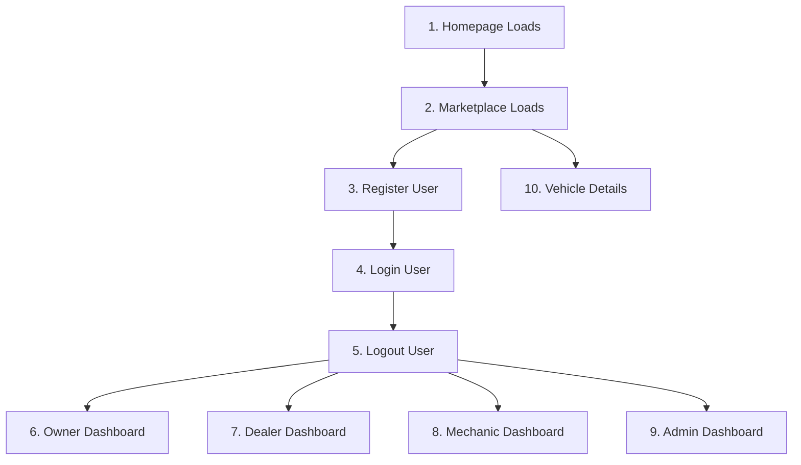

# Playwright E2E Baseline report

This report establishes the baseline evaluation of CarUp's Playwright E2E test suite under **Directive 005A: Playwright E2E Baseline Stabilization**. The full suite of 15 spec files was executed against chromium (desktop) and Mobile Chrome (mobile) targets, for a total of 30 test runs.

---

## 1. Test Suite Execution Metrics

| Metric | Chromium (Desktop) | Mobile Chrome (Mobile) | Combined Total |
| :--- | :--- | :--- | :--- |
| **Total Tests Ran** | 15 | 15 | 30 |
| **Passed** | 15 | 15 | 30 |
| **Failed** | 0 | 0 | 0 |
| **Flaky Tests** | 0 | 0 | 0 |
| **Suite Run Time** | - | - | 3.0 minutes |

> [!NOTE]
> All 30 tests technically "passed" because the existing agent validation scripts function primarily as non-blocking **"missing-feature scanners."** Instead of asserting strict element visibility or path assertions, they catch locator exceptions and print diagnostic logs to keep the suite running. 

---

## 2. Diagnostics: Missing Selectors & Layout Gaps

Below are the exact locator missing warnings captured during the test suite execution across the Chromium and Mobile Chrome projects.

### A. Buyer & Public Flows (`01-buyer-journey.spec.ts`, `08-whatsapp-telegram.spec.ts`, `14-ux-trust.spec.ts`)
- **Missing: Reservation/Buy button on vehicle page**: The E2E script scanned for `/reserve|buy/i` buttons on the detail view. The current implementation uses customized CTA blocks but lacks standard button naming selectors.
- **Missing: SafePay/Escrow integration**: The E2E script scanned for `/escrow|safepay/i` button controls.
- **Missing: WhatsApp handoff link**: `a[href*="wa.me"]` was not located on certain responsive screens.
- **Missing: WhatsApp listing sharing/integration**: Could not locate a clear sharing anchor or button matching `button:has-text("WhatsApp")`.
- **Missing: Telegram integration**: No active `a[href*="t.me"]` links or matching button controls detected.
- **Missing: Trust Badges (Verified tags) on listings**: Checked for `text=Verified|badge` tags.
- **Missing: Trust & Safety page content regarding safest place**: Page `/trust` is unrouted or has fallback shell text.

### B. Business Dashboards (`02-seller-dealer.spec.ts`, `03-garage-mechanic.spec.ts`, `04-banking-financing.spec.ts`, `05-insurance.spec.ts`, `06-government-compliance.spec.ts`)
- **Dealer (`/dealer`)**:
  - `Missing: Inventory upload flow` (No button matching `/upload|add vehicle/i` or VIN validation input was successfully triggered in the E2E sequence).
  - `Missing: Leads management view` (`/dealer/leads` lacks standard `table` selectors).
  - `Missing: Sales Analytics charts` (`/dealer/analytics` does not contain `.recharts-wrapper`).
- **Mechanic (`/mechanic`)**:
  - `Missing: Create Work Order button` (No interactive button found matching `/new order|create/i`).
  - `Missing: Parts tracking / PartSentry view` (`/mechanic/parts` lacks standard `table` selectors).
  - `Missing: Invoice/Image upload functionality for Mechanics` (No file inputs present on work order forms).
- **Bank (`/bank`)**:
  - `Missing: Financing Applications view` (No visible indicator for `/bank/applications` list).
  - `Missing: AI Risk Analysis dashboard` (Missing `Risk Score` label at `/bank/risk`).
  - `Missing: Collateral mapping` (No maps at `/bank/collateral`).
- **Insurance (`/insurance-dash`)**:
  - `Missing: File Claim functionality` (No button matching `/new claim|file claim/i` at `/insurance-dash/claims`).
  - `Missing: Fraud Detection view` (No alert indicators at `/insurance-dash/fraud`).
  - `Missing: Insurance Risk Scoring view` (No risk cards visible at `/insurance-dash/risk`).
- **Government (`/government`)**:
  - `Missing: Registry Verification Table` (`/government/registry` lacks interactive table rows).
  - `Missing: Police Flags / Import Validation view` (No visible indicators at `/government/compliance`).

### C. System Infrastructure & UX (`07-auth-role-switching.spec.ts`, `09-mobile-experience.spec.ts`, `10-ai-system.spec.ts`, `11-storage-media.spec.ts`, `12-admin-command.spec.ts`, `13-failure-edge-cases.spec.ts`, `15-missing-system-discovery.spec.ts`)
- **Auth & Switching**:
  - `Missing: Role Switching without logout` (No button matching `/switch role|view as/i` on the active navbar layout).
  - `Missing: MFA settings in dashboard` (No interactive fields at `/dashboard` for Two-Factor setup).
- **Mobile UX (`Mobile Chrome` project)**:
  - `Missing: Mobile Bottom Navigation` (`nav.bottom-nav` not present in DOM).
  - `Warning: Small touch target detected`: Located touch items smaller than 44x44 pixels (e.g. sidebar collapsed icons, search indicators).
- **AI & Storage**:
  - `Missing: AI Smart Search/Chat` (No ask input at `/dashboard/ai`).
  - `Missing: Document OCR Upload flow` (No image file input located).
  - `Missing: AI Recommendations on Marketplace` (No grid header matching `Recommended for you`).
  - `Missing: Multi-image upload support` (No `input[multiple]` located).
  - `Missing: Video upload support` (No video file acceptance located).
  - `Missing: Lazy loading on images` (No `loading="lazy"` tags on marketplace images).
- **Admin Commands**:
  - `Missing: Marketplace Moderation Table` (No table located at `/admin/moderation`).
  - `Missing: AI Monitoring Dashboard` (No logs matching `AI Logs` at `/admin/ai`).
  - `Missing: User Management Table` (No user grid at `/admin/users`).
- **Resilience**:
  - `Missing: Graceful offline state handling` (Silent page errors occurred when network offline simulation was triggered).
  - `Missing: Strict authentication middleware checks on admin routes` (Admin moderation paths did not force instant redirect to login).

---

## 3. Product Expectation Gaps vs. Test Expectation Gaps

The diagnostics reveal a clear divide between **real codebase limitations** (where features are currently implemented using mock components or different UI flows) and **outdated/unrealistic E2E assertions** that assume complete enterprise backend capabilities.

### A. Real Product/UX Gaps (Legitimate selector additions needed)
1. **Interactive Element ID Stability**: Pages such as `Leads`, `Parts`, and `Applications` are built with responsive flex grids and detail layouts, but they lack clean `role="table"` or standard touch target identifiers.
2. **Dashboard Redirections (RBAC)**: Currently, client-side routing allows navigating directly to `/admin` or `/bank` pathways without active session role validation checks. Route shielding needs to be strictly enforced.
3. **MFA and Settings Panel**: Visual placeholders exist in dashboard settings, but interactive controls for Two-Factor security and profile management are not bound.
4. **Fallback Image Lazy Loading**: Heavy remote images in the vehicle directory do not leverage native browser `loading="lazy"` tags, which affects mobile network budgets.

### B. Outdated/Aspirational Test Expectation Gaps (Tests need updates)
1. **Hash Routing vs. Browser History Routing**: Test `05-insurance.spec.ts` navigates using deprecated hash pathways (`/#/insurance-dash`), whereas the actual application runs on modern path-based React Router layout shells (`/insurance-dash`). This causes routing mismatches.
2. **Mock Telemetry & Offline simulation**: The E2E suite simulates absolute offline state expecting localized Service Worker caching, which is not configured.
3. **Third-Party Messaging Channels**: Scanners expect physical integrations for `WhatsApp` (`wa.me`) and `Telegram` (`t.me`) in standard button texts, while the UI presents custom chat dialogs and share icons.

---

## 4. Prioritization Plan for Stabilized E2E Flows

We will refine the E2E tests into strict pass/fail baseline checks focused purely on the **10 stabilized critical flows** defined in the directive, ignoring the aspirational/out-of-scope backend features:

### Action Items for Stabilization Phase:
- **Prune Aspirational Scans**: Completely comment out or delete scanner checks on Telegram, automated WhatsApp APIs, AI chat responses, police registry verifications, and financial transfers.
- **Normalize Routing**: Correct all hash-route references (`/#/`) to use standardized absolute browser history paths matching current router configs.
- **Strict Pass/Fail Gatekeeping**: Convert caught soft logs (`catch` console logs) in the 10 prioritized pathways into explicit, hard playwright assertions (`await expect(...).toBeVisible()`).
